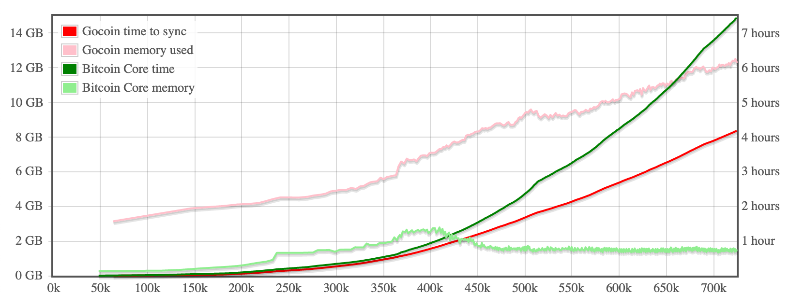

# About Gocoin

**Gocoin** is a full **Bitcoin** solution written in Go language (golang).

The software architecture is focused on maximum performance of the node
and cold storage security of the wallet.

The **wallet** is designed to be used offline.
It is deterministic and password seeded.
As long as you remember the password, you do not need any backups ever.
Wallet can be used without the client, but with the provided **balio** tool instead.

The **client** (p2p node) is an application independent from the **wallet**.
It keeps the entire UTXO set in RAM, providing an instant access to all its records
and - in consequece - an extraordinary blochchain processing performance.

System memory and time Gocoin client 1.10.1 needs to sync the blockchain up to
the given block number, with comparision to Bitcoin Core 23.0:

*The above data was collected using [Hetzner](https://hetzner.com) dedicated server
with 3.4GHz Intel i7-6700 CPU, 2x2TB HDD and 1Gb internet connection.
Both the clients were using their default configuration.  
For more performance results see [gocoin.pl](https://gocoin.pl/gocoin_performance.html) website.*

# Requirements

## Hardware

**client**:

* 64-bit architecture OS and Go compiler.
* File system supporting files larger than 4GB.
* At least 16GB of system RAM.

**wallet**:

* Any platform that you can make your Go (cross)compiler to build for (Raspberry Pi works).
* For security reasons make sure to use encrypted swap file (if there is a swap file).
* If you decide to store your password in a file, have the disk encrypted (in case it gets stolen).

## Operating System
Having hardware requirements met, any target OS supported by your Go compiler will do.
Currently that can be at least one of the following:

* Windows
* Linux
* macOS
* Free BSD

## Build environment
In order to build Gocoin yourself, you will need the following tools installed in your system:

* **Go** (recent version) - http://golang.org/doc/install
* **Git** - http://git-scm.com/downloads

If the tools mentioned above are all properly installed, you should be able to execute `go` and `git`
from your OS's command prompt without a need to specify full path to the executables.

# Getting sources

Download the source code from github to a local folder of your choice, e.g. by executing:

	git clone https://github.com/piotrnar/gocoin.git

# Building

## Client node
Go to the `client/` folder and execute `go build` there.

## Wallet
Go to the `wallet/` folder and execute `go build` there.

## Tools
Go to the `tools/` folder and execute:

	go build btcversig.go

Repeat the `go build` for each source file of the tool you want to build.

# Binaries

Windows or Linux (amd64) binaries can be downloaded from

 * https://sourceforge.net/projects/gocoin/files/?source=directory

Please note that the binaries are usually not up to date.
I strongly encourage everyone to build the binaries himself.

# Development
Although it is an open source project, I am sorry to inform you that **I will not merge in any pull requests**.
The reason is that I want to stay an explicit author of this software, to keep a full control over its
licensing. If you are missing some functionality, just describe me your needs and I will see what I can do
for you. But if you want your specific code in, please fork and develop your own repo.

# Support
The official web page of the project is served at <a href="http://gocoin.pl">gocoin.pl</a>
where you can find extended documentation, including **User Manual**.

Please do not log github issues when you only have questions concerning this software.
Instead see [Contact](http://gocoin.pl/gocoin_links.html) page at [gocoin.pl](http://gocoin.pl) website
for possible ways of contacting me.

If you want to support this project, I ask you to run your own Gocoin node, prefably with TCP port 8333
open for the outside world. Do not hestiate to report any issues you find.
